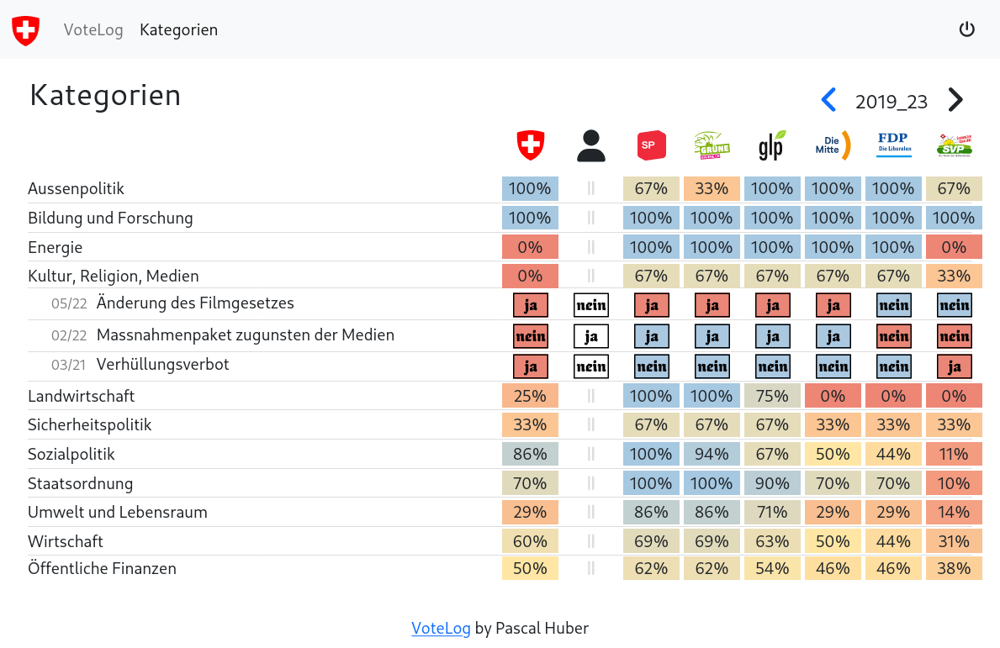

# VoteLog

A small Webapp I use to keep track of my votes in Switzerland and see which
parties agree with me.

## Features
 
 - Show and compare results of Swiss referendums and initiatives
 - Provide reasoning for decision
 - Vote Category Overview
 - Load and store data to WebDAV (no backend)


(those are not my votes, at least not all of them...)

## Setup

### Build and run Development WebDAV server
```
docker build -t webdav-dev dev/webdav/
docker-compose -f dev/webdav/docker-compose.yml up -d
``` 

### Install dependencies
```
npm install
```

### Compiles and hot-reloads for development
```
npm run serve
```

### Compiles and minifies for production
```
npm run build
```

### Lints and fixes files
```
npm run lint
```


