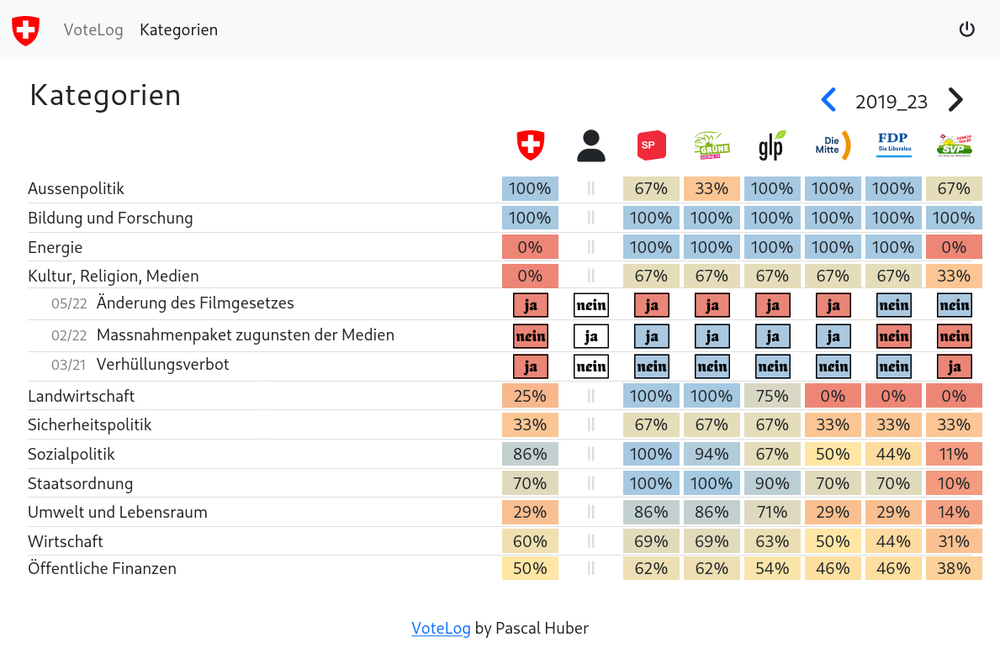

# VoteLog

A small Webapp I use to keep track of my votes in Switzerland and see which
parties agree with me.


(those are not my votes, at least not all of them...)

## Features

- Show and compare results of Swiss referendums and initiatives
- Provide reasoning for decision
- Vote Category Overview

## Technical

- Built with Vue.js, Vuex, Vue Router
- There is no (real) backend. Data is stored in WebDAV in
  *bring-your-own-WebDAV* manner. Note that if WebDAV and VoteLog are running on
  different (sub)domains, CORS must be configured accordingly. Otherwise the
  browser will block the connections. This disqualifies many managed solutions.
  All the data is stored in a file called `votelog_<user-email>.json` (multiple
  users can share a WebDAV server).
- OpenID Connect is used for authentication. VoteLog stores the Token in
  SessionStorage (which survives a refresh but is removed when the browser tab
  is closed).

## Known Issues

Functional:
- Doesn't handle *Gegenentwürfe* very well.

Technical:
- Error handling for the WebDAV connection (fetching and storing data) could be
  better.

## Setup

### Build and run Development Apache2 (DAV, Proxy) and Dex (OIDC)

```
docker compose -f dev/webdav/docker-compose.yml up -d --build 
```

### Install dependencies

```
npm install
```

### Compiles and hot-reloads for development

```
npm run dev
```

### Compiles and minifies for production

```
npm run build
```

### Lints and fixes files

```
npm run lint
npm run format
```
